# "Podify" using Podman Desktop 
   The purpose of this demo is to show how to convert containers into a Pod and deploy it to a kubernetes cluster.
   This demo is in the format of a podman desktop extension which will provide the setup for performing the "podify" operation by deploying 2 containers.

## Pre-requisites
   - Connect to a Kubernetes cluster using Podman-Desktop

## Installation
   - From Podman Desktop Settings/Extension page, click on Custom Installation 
   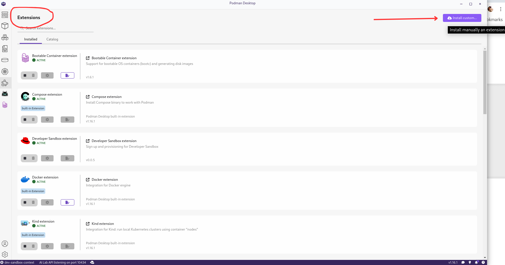

   - Enter `quay.io/podman-desktop-demo/podman-desktop-extension` on the 'Install custom extension from OCI Image' form.
   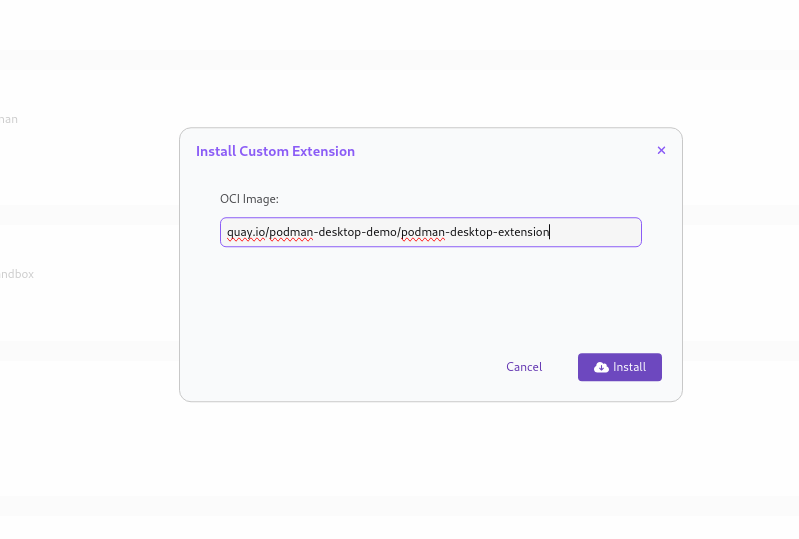

   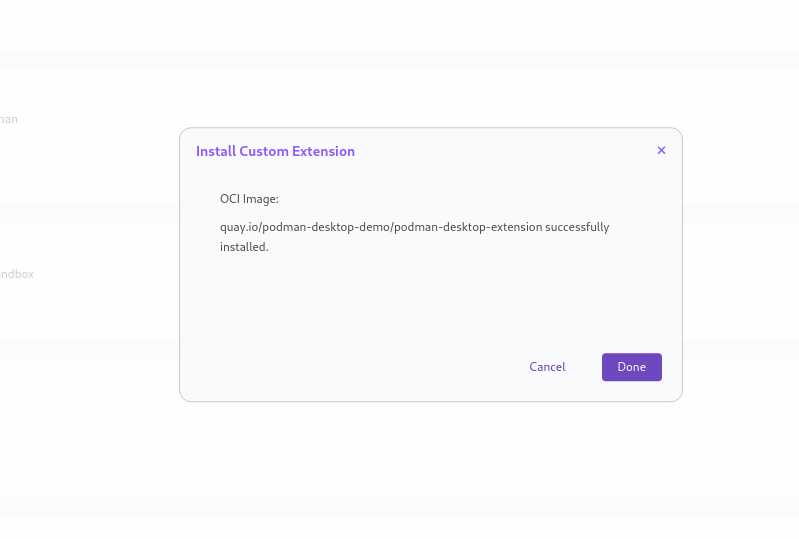

   - The status "Frontend container not running" is displayed in the taskbar on the bottom left.
   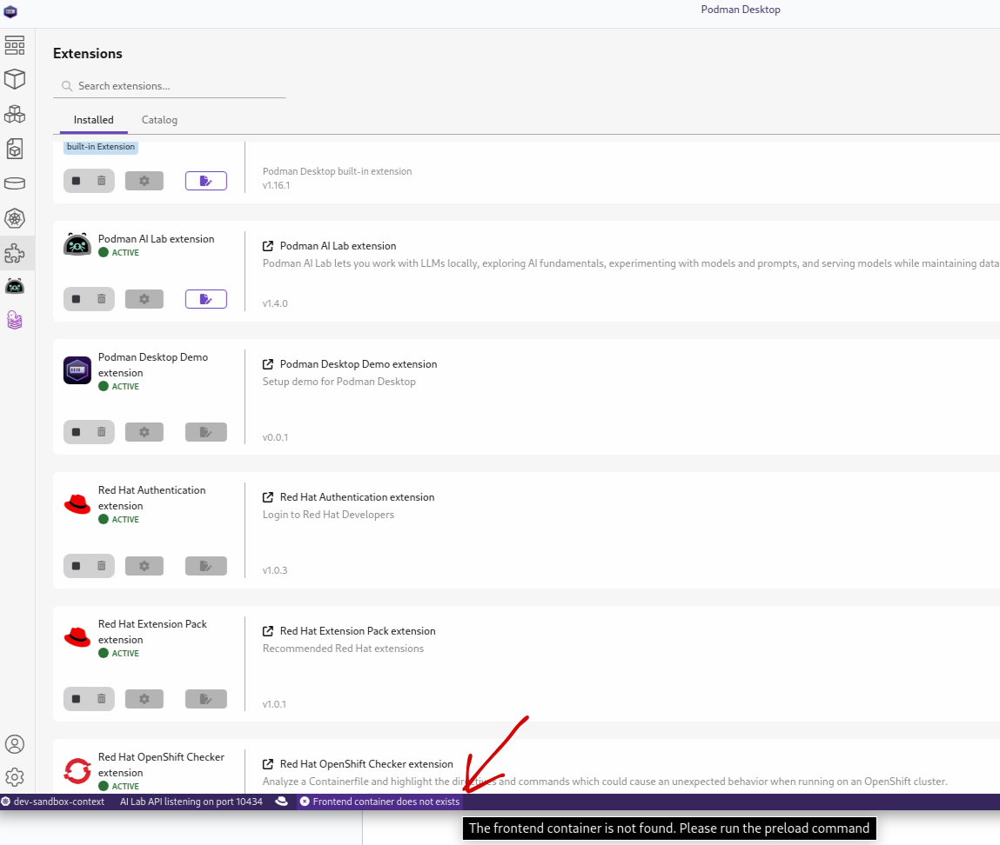

   - Click on it, this will pull 2 images for the containers

   - Within a few seconds, the status "Podify Demo Ready" will appear on the status bar.
   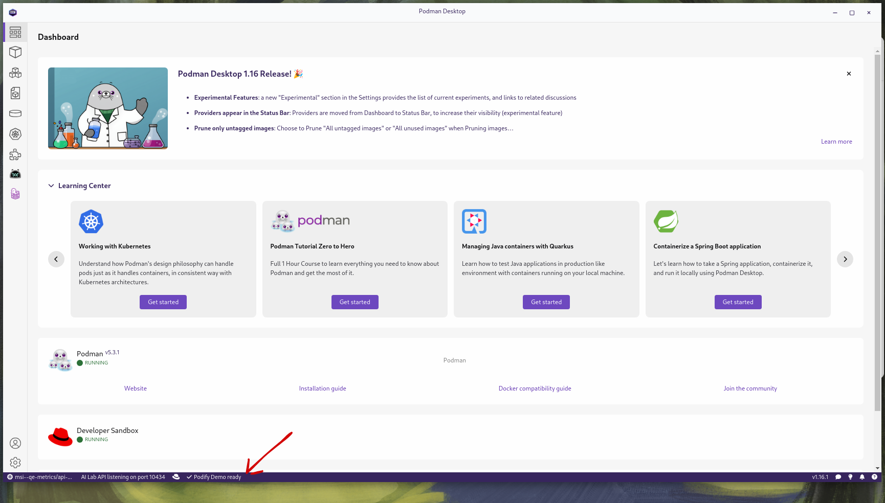

   - Click on "Containers" in the navigation bar.

   - You should see two containers listed: one for the frontend and one for Redis.
   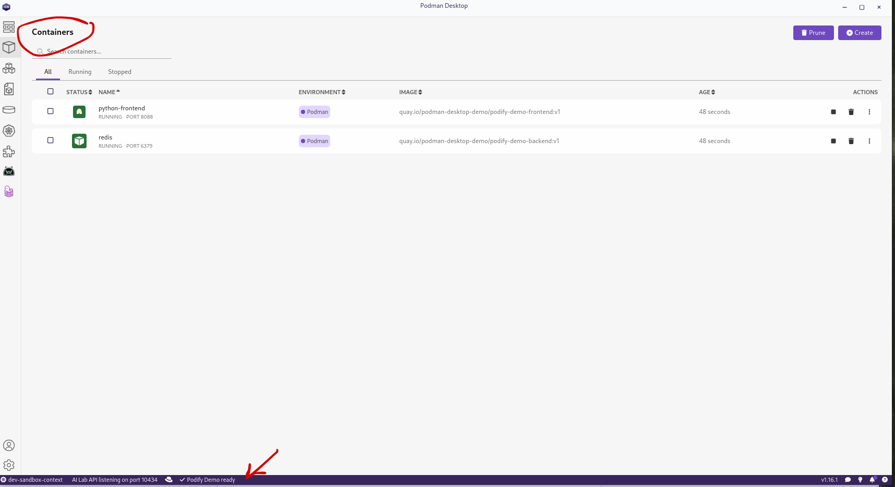

   - Start the containers.

   - Once the containers are started, view the Python frontend container by selecting "Export to Browser."
   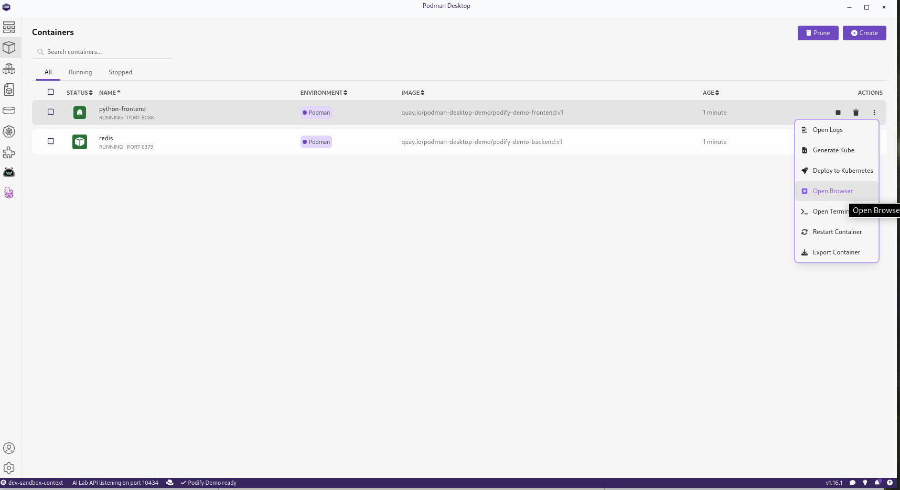

   - A webpage is displayed running on localhost.
   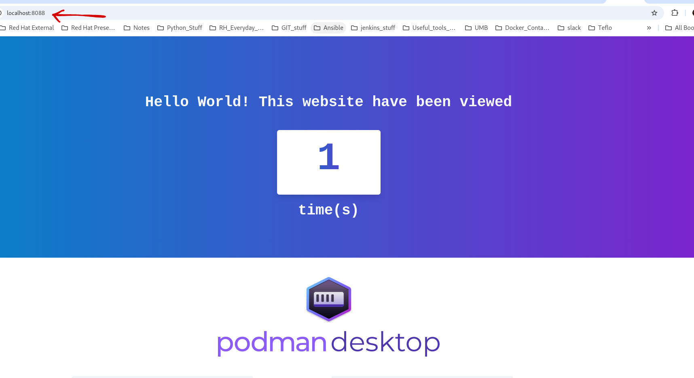

   - Use these two containers to create a pod
   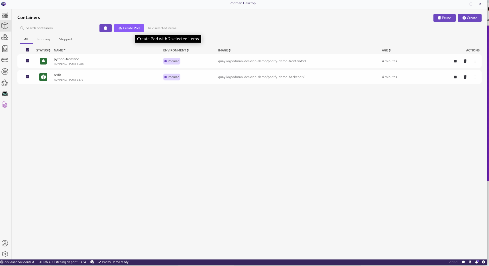
   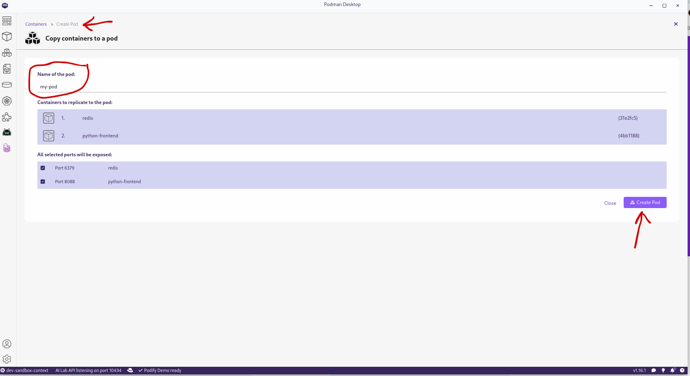

   - Export this pod to the Kubernetes cluster that is connected to the Podman desktop
   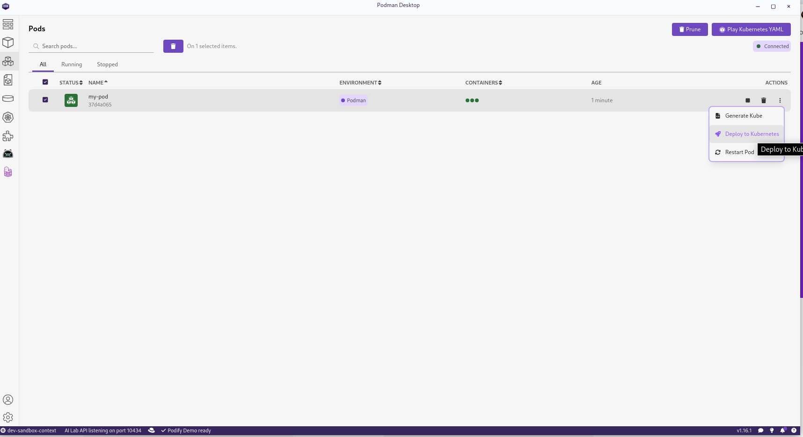
   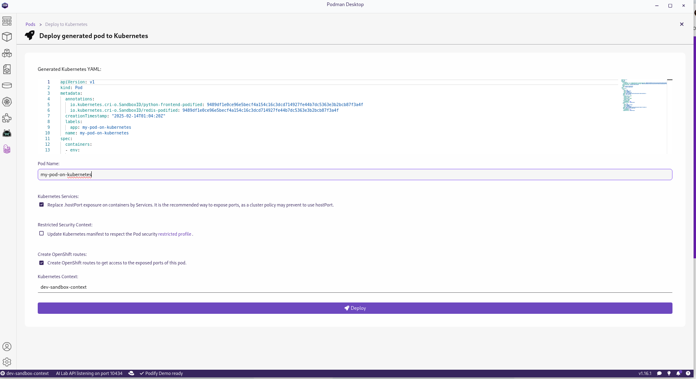
   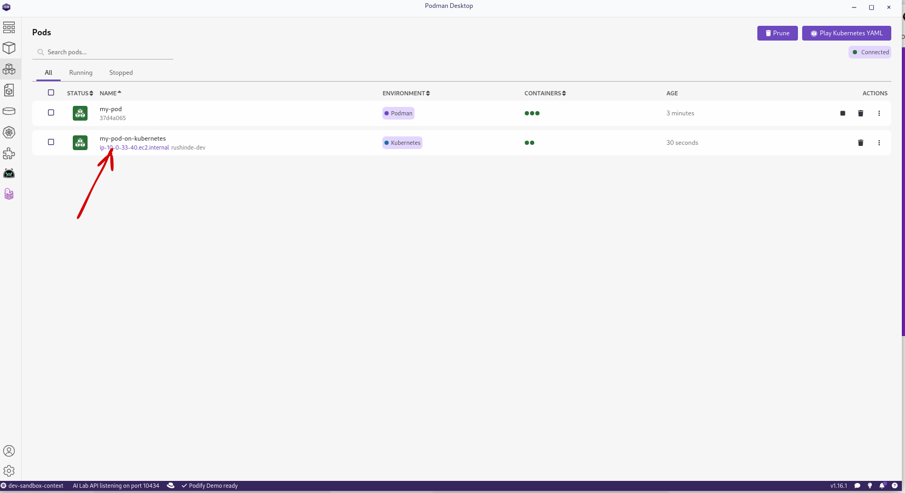

   - View these 2 containers deployed on the cluster.
   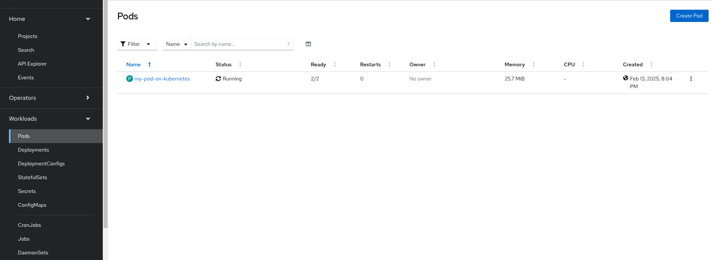

   - Click the route to the frontend pod.
   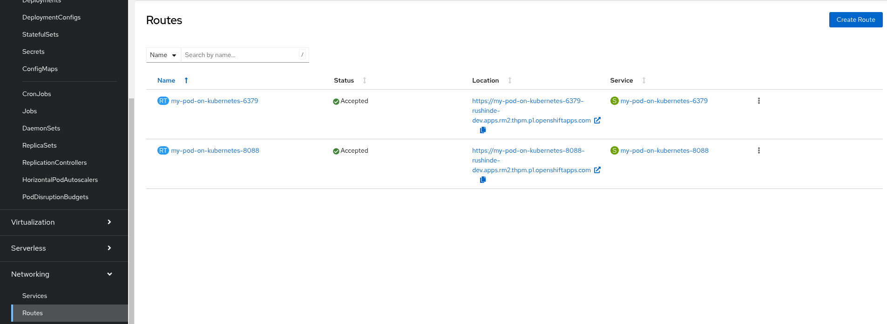

   - View the same webpage but running on the cluster.
   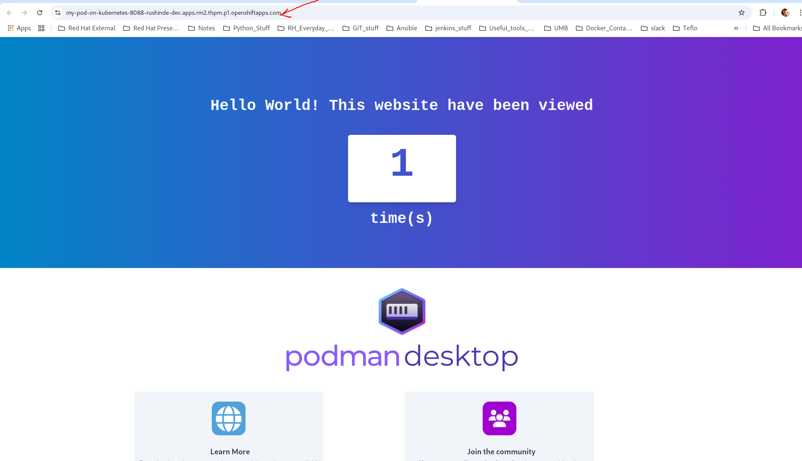

   - Stop the containers and delete them from Podman Desktop 

